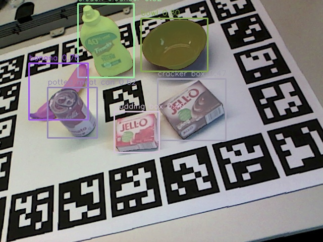
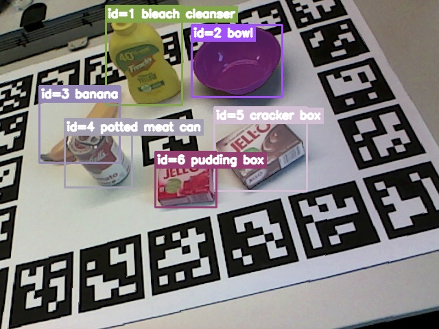
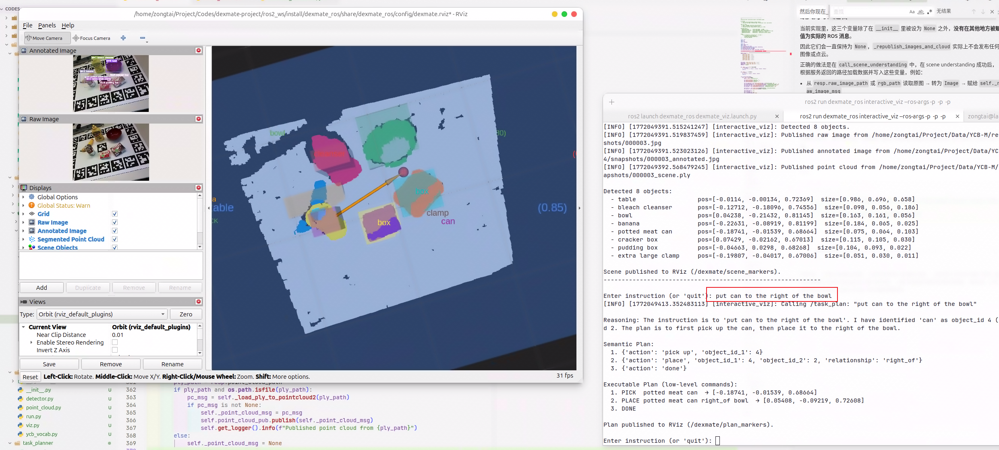

# dexmate-project

Dexmate take-home 原型实现：**Scene Understanding → Language-Grounded Task Planning**，面向桌面 pick-and-place 场景。

- **2.1** Scene Understanding：RGB-D → 检测分割 → 场景 JSON
- **2.2** Task Planner：自然语言指令 → VLM 语义规划 → 可执行坐标
- **2.3** RViz 可视化：ROS 2 集成，raw/annotated 图像、彩色点云、low-level commands

所有代码在 `cl_cotnav` conda 环境下运行。

---

## 目录结构

```
dexmate-project/
├── scene_understanding/
│   ├── detector.py       # Grounding DINO + SAM 检测与分割
│   ├── point_cloud.py    # 深度反投影、RANSAC 桌面拟合、SOR 去噪、PCA 朝向、OBB
│   ├── ycb_vocab.py      # YCB-M 开放词汇表
│   └── run.py            # 端到端流水线入口
├── task_planner/
│   ├── planner.py        # Stage 1: Gemini VLM 语义规划
│   ├── resolver.py       # Stage 2: 语义计划 → 带坐标的可执行计划
│   ├── validator.py      # 两阶段验证
│   └── run.py            # CLI 入口（支持 --dry-run）
├── ros2_ws/              # 2.3 RViz 可视化（ROS 2）
│   └── src/
│       ├── dexmate_ros/      # scene_node, planner_node, interactive_viz
│       └── dexmate_interfaces/
├── output/               # 所有输出文件
└── README.md
```

---

## 2.1 Scene Understanding

**流水线：** RGB-D → Grounding DINO（开放词汇检测）→ SAM（分割）→ 深度反投影 → RANSAC 桌面拟合 → SOR 去噪 → PCA 朝向 + OBB → 场景 JSON

### 运行

```bash
conda activate cl_cotnav
cd /home/zongtai/Project/Codes/dexmate-project

# 跑 3 个预设场景
python -m scene_understanding.run

# 指定场景和帧号
python -m scene_understanding.run --scene 005_006_008_009_011_024 --frame 3

# 关闭可视化
python -m scene_understanding.run --scene 005_006_008_009_011_024 --frame 3 --no-visualize

# 调整检测阈值
python -m scene_understanding.run --box-threshold 0.30
```

### CLI 参数

| 参数 | 类型 | 默认值 | 说明 |
|------|------|--------|------|
| `--scene` | str | None | 场景文件夹名（如 `005_006_008_009_011_024`），不指定则跑所有预设场景 |
| `--frame` | int | 0 | 帧号 |
| `--visualize / --no-visualize` | flag | True | 是否生成可视化图片 |
| `--box-threshold` | float | 0.35 | Grounding DINO 检测置信度阈值 |
| `--device` | str | `cuda` | 推理设备 |

### 输出文件

输出保存在 `output/`，文件名格式 `{scene}_f{frame:03d}_*`：

| 文件 | 说明 |
|------|------|
| `*_scene.json` | 场景 JSON，每个物体一条记录 |
| `*_scene.ply` | 彩色点云（按 object_id 着色） |
| `*_vis.jpg` | 检测可视化（bbox + mask + label） |
| `*_vlm.jpg` | VLM 标注图（bbox + mask + object_id 标签在框内） |

### Scene JSON 格式

```json
[
  {
    "object_id": 0,
    "label": "table",
    "confidence": 0.85,
    "centroid_xyz": [-0.011, -0.001, 0.723],
    "size_xyz": [0.986, 0.696, 0.656],
    "yaw": 0.0,
    "bbox": [0.0, 0.0, 0.0, 0.0],
    "num_points": 121249,
    "table_u_axis": [0.973, -0.128, -0.191],
    "table_v_axis": [-0.0, -0.830, 0.557],
    "table_normal": [-0.230, -0.543, -0.808]
  },
  {
    "object_id": 1,
    "label": "bleach cleanser",
    "confidence": 0.82,
    "centroid_xyz": [-0.127, -0.181, 0.746],
    "size_xyz": [0.098, 0.061, 0.175],
    "yaw": -0.372,
    "bbox": [252.7, 98.1, 316.2, 278.1],
    "num_points": 5847
  }
]
```

**字段说明：**

| 字段 | 类型 | 说明 |
|------|------|------|
| `object_id` | int | 唯一标识（0 起始，table 总是 0） |
| `label` | str | 物体类别 |
| `confidence` | float | 检测置信度（table 为 RANSAC inlier ratio） |
| `centroid_xyz` | [x, y, z] | 物体质心（相机坐标系，米） |
| `size_xyz` | [l, w, h] | OBB 尺寸：length（主轴）× width（侧轴）× height（法线方向），米 |
| `yaw` | float | 物体在桌面上的朝向角（弧度，相对 table_u 轴），table 固定为 0 |
| `bbox` | [x1, y1, x2, y2] | 2D 检测框（像素），table 为 [0,0,0,0] |
| `num_points` | int | 点云点数 |
| `table_u_axis` | [x, y, z] | 仅 table：桌面 U 轴（近似相机 X 方向在桌面的投影） |
| `table_v_axis` | [x, y, z] | 仅 table：桌面 V 轴 |
| `table_normal` | [x, y, z] | 仅 table：桌面法线（朝向相机方向） |

### 处理流程

1. **检测与分割**：Grounding DINO 开放词汇检测 → SAM 实例分割
2. **深度反投影**：全图深度 → 3D 点云（使用相机内参）
3. **RANSAC 桌面拟合**：检测主平面 → 构建桌面坐标系 (u, v, normal)
4. **逐物体提取**：按 mask 提取点云 → SOR 统计离群点去噪 → PCA 计算朝向 (yaw) → 计算 OBB 尺寸
5. **输出**：Scene JSON + 彩色 PLY + 可视化图 + VLM 标注图

### Python API

```python
from scene_understanding.detector import GroundedSAMDetector
from scene_understanding.point_cloud import extract_object_point_clouds, export_scene_ply, REALSENSE_R200
from scene_understanding.ycb_vocab import YCB_VOCAB

# 检测 + 分割
detector = GroundedSAMDetector(classes=YCB_VOCAB, box_threshold=0.35, device="cuda")
boxes, confs, labels, masks = detector.detect_and_segment(rgb_bgr)
# boxes: (N, 4), confs: (N,), labels: (N,) str, masks: (N, H, W) bool

# 3D 点云提取
scene_json, raw_clouds = extract_object_point_clouds(
    depth=depth_uint16, masks=masks, labels=labels, confidences=confs, boxes=boxes,
    intrinsics=REALSENSE_R200, depth_scale=1e-4,
)
# scene_json: list[dict], raw_clouds: dict[str, np.ndarray(M,3)]

# 导出彩色 PLY
export_scene_ply(raw_clouds, "output/scene.ply")
```

---

## 2.2 Language-Grounded Task Planner

基于 Gemini VLM 的两阶段语言引导任务规划器。

### 为什么分两阶段？

VLM 的空间/数值推理能力有限，直接生成 `[x, y, z]` 坐标不可靠。因此：

- **Stage 1（VLM）**：只输出语义决策 — 抓哪个物体、放到哪个物体旁边、什么空间关系。不生成任何坐标。
- **Stage 2（Resolver）**：确定性模块，从 Scene JSON 查找质心，根据空间关系和两个物体的朝向/尺寸计算放置坐标。

所有坐标都来自感知系统（Task 2.1），不依赖 VLM 幻觉。

### 架构

```
  原图 + 标注图 + Scene JSON + 自然语言指令
               │
      ┌────────▼────────┐
      │  Stage 1: VLM   │  Gemini → 语义计划（无坐标）
      │  (planner.py)   │  e.g. pick up obj 3, place obj 3 next_to obj 5
      └────────┬────────┘
               │ validate_semantic_plan
      ┌────────▼────────┐
      │  Stage 2:       │  查质心 + 朝向感知偏移
      │  Resolver       │  分离轴定理投影 OBB
      │  (resolver.py)  │  → 可执行坐标
      └────────┬────────┘
               │ validate_resolved_plan
               ▼
      带 [x, y, z] 的可执行计划
```

### 运行

```bash
conda activate cl_cotnav
cd /home/zongtai/Project/Codes/dexmate-project

# dry-run（不调用 API，演示完整流程）
python -m task_planner.run --dry-run \
    --scene-json output/005_006_008_009_011_024_f003_scene.json \
    --instruction "Put the banana next to the bowl."

# 调用 Gemini API
export GEMINI_API_KEY="your-key"
python -m task_planner.run \
    --scene-json output/005_006_008_009_011_024_f003_scene.json \
    --instruction "Put the banana next to the bowl."
```

> **图片自动发现**：给定 `output/xxx_scene.json`，自动查找同目录的 `xxx_vis.jpg`（原图）和 `xxx_vlm.jpg`（标注图），两张图都传给 VLM。也可通过 `--image` / `--vlm-image` 手动指定。

### CLI 参数

| 参数 | 类型 | 默认值 | 说明 |
|------|------|--------|------|
| `--api-key` | str | env `GEMINI_API_KEY` | Gemini API key |
| `--model` | str | `gemini-2.5-flash` | 模型名称 |
| `--scene-json` | str | **必填** | Scene Understanding 输出的 JSON 路径 |
| `--instruction` | str | **必填** | 自然语言指令 |
| `--image` | str | 自动发现 | 原始 RGB 图片路径 |
| `--vlm-image` | str | 自动发现 | 标注图路径（带 object_id） |
| `--dry-run` | flag | False | 不调用 API，使用示例数据演示 |

### VLM 输入

VLM 同时接收 4 个输入以实现最佳 grounding：

1. **原图** — 保留物体纹理、颜色、遮挡细节
2. **标注图** — bbox + mask + "id=N label" 标签，用于 object_id 对齐
3. **Scene JSON**（VLM 格式）— `object_id`, `class`, `position`, `size`, `yaw`, `confidence`
4. **自然语言指令**

### 可用动作与关系

**动作：**
- `pick up <object_id>` — 抓取
- `place <object_id_1> <relationship> <object_id_2>` — 放置

**关系：** `on` | `in` | `next_to` | `in_front_of` | `behind` | `left_of` | `right_of`

### 输出示例

**Stage 1 — 语义计划（VLM 输出，无坐标）：**

```json
[
  {"action": "pick up", "object_id_1": 4},
  {"action": "place", "object_id_1": 4, "object_id_2": 5, "relationship": "next_to"},
  {"action": "done"}
]
```

**Stage 2 — 可执行计划（带坐标）：**

```json
[
  {"action": "pick up", "object_id_1": 4, "position": [0.12, -0.05, 0.68]},
  {"action": "place", "object_id_1": 4, "object_id_2": 5, "position": [0.25, 0.07, 0.66], "relationship": "next_to"},
  {"action": "done"}
]
```

### 坐标解算逻辑

- **pick up**：position = 目标物体质心
- **place**：position = 参考物体质心 + 朝向感知偏移
  - 偏移方向由参考物体的 yaw 决定（`left_of` → 参考物体 side 轴负方向，`in_front_of` → forward 轴，等）
  - 偏移距离 = ref 半径 + target 半径 + 2cm 间隙
  - 两个物体的 OBB 都通过分离轴定理投影到偏移方向上，正确处理不同朝向的情况

### Python API

```python
from task_planner.planner import TaskPlanner
from task_planner.resolver import resolve_plan
from task_planner.validator import validate_semantic_plan, validate_resolved_plan

# Stage 1: VLM 语义规划
planner = TaskPlanner(api_key="your-key", model="gemini-2.5-flash")
result = planner.plan(
    scene_json=scene_json,            # list[dict] — Scene Understanding 输出
    instruction="Put the mug on the bowl.",
    rgb_image=rgb_bgr,                # np.ndarray (H,W,3) BGR 原图（可选）
    annotated_image=annotated_bgr,    # np.ndarray (H,W,3) BGR 标注图（可选）
)
# result = {"reasoning": str, "plan": list[dict], "validation": dict}

# Stage 2: 坐标解算
executable = resolve_plan(result["plan"], scene_json, gap=0.02)
# list[dict] — 每个 pick/place 带 "position": [x, y, z]

# 验证
known_ids = {obj["object_id"] for obj in scene_json}
sem_val = validate_semantic_plan(result["plan"], known_ids)
res_val = validate_resolved_plan(executable)
# {"valid": bool, "errors": [...], "warnings": [...]}
```

---

## End-to-End Example

以场景 `005_006_008_009_011_024` frame 3 为例，指令：**"Put the can to the right of the bowl."**

### Step 1: Scene Understanding

```bash
python -m scene_understanding.run --scene 005_006_008_009_011_024 --frame 3
```

**检测可视化 (`*_vis.jpg`)：**



**VLM 标注图 (`*_vlm.jpg`)：**



**检测到的物体 (`*_scene.json`)：**

| object_id | label | confidence | centroid_xyz | size_xyz (OBB) | yaw |
|-----------|-------|------------|--------------|----------------|-----|
| 0 | table | 0.85 | [-0.011, -0.001, 0.723] | [0.986, 0.696, 0.656] | 0.0 |
| 1 | bleach cleanser | 0.82 | [-0.127, -0.181, 0.746] | [0.098, 0.057, 0.187] | -2.916 |
| 2 | bowl | 0.80 | [0.043, -0.214, 0.812] | [0.163, 0.161, 0.057] | -3.063 |
| 3 | banana | 0.78 | [-0.226, -0.090, 0.812] | [0.178, 0.065, 0.025] | 0.947 |
| 4 | potted meat can | 0.62 | [-0.187, -0.015, 0.687] | [0.075, 0.064, 0.103] | 2.509 |
| 5 | cracker box | 0.47 | [0.074, -0.021, 0.670] | [0.115, 0.105, 0.032] | -2.712 |
| 6 | pudding box | 0.40 | [-0.047, 0.030, 0.683] | [0.104, 0.092, 0.023] | 2.818 |

### Step 2: Task Planning

```bash
export GEMINI_API_KEY="your-key"
python -m task_planner.run \
    --scene-json output/005_006_008_009_011_024_f003_scene.json \
    --instruction "Put the can to the right of the bowl."
```

**VLM Reasoning：**

> The instruction is to "Put the can to the right of the bowl". I will identify the "potted meat can" (object_id=4) and the "bowl" (object_id=2). First, I will pick up the "potted meat can". Then, I will place it to the right of the "bowl". Finally, I will mark the task as done.

**Stage 1 — 语义计划（VLM 输出）：**

```json
[
  {"action": "pick up", "object_id_1": 4},
  {"action": "place", "object_id_1": 4, "object_id_2": 2, "relationship": "right_of"},
  {"action": "done"}
]
```

**Stage 2 — 可执行计划（坐标解算后）：**

```json
[
  {"action": "pick up", "object_id_1": 4, "position": [-0.187, -0.015, 0.687]},
  {"action": "place", "object_id_1": 4, "object_id_2": 2, "position": [0.053, -0.105, 0.736], "relationship": "right_of"},
  {"action": "done"}
]
```

---

## 2.3 RViz 可视化（Stretch Goal）

将 Scene Understanding 和 Task Planner 与 ROS 2 集成，在 RViz 中展示：



- **Raw Image** — 原始 RGB 图像
- **Annotated Image** — 带检测框、mask、object_id 标注的图像
- **Segmented Point Cloud** — 按物体着色的分割点云
- **Low-Level Commands** — 输入 instruction 后显示 pick/place 等可执行命令

**Note** 这里我用pca计算了物体的主轴，并且尝试把左右与物体的朝向结合起来，所以这里是放到了右下角。但似乎左右的定义比较模糊，更应该从摄像头观察的角度来定义。这其实更容易实现，不需要做pca计算朝向啥的，直接全用世界系计算就好了。不过我已经把apikey删掉了，就算了。

### 运行

```bash
# 终端 1：启动 scene_node、planner_node、RViz
cd /home/zongtai/Project/Codes/dexmate-project/ros2_ws
source install/setup.bash
ros2 launch dexmate_ros dexmate_viz.launch.py default_api_key:=YOUR_GEMINI_KEY

# 终端 2：运行交互式可视化（需指定 rgb/depth 路径）
ros2 run dexmate_ros interactive_viz --ros-args \
    -p rgb_path:=/home/zongtai/Project/Data/YCB-M/realsense_r200/005_006_008_009_011_024/snapshots/000003.jpg \
    -p depth_path:=/home/zongtai/Project/Data/YCB-M/realsense_r200/005_006_008_009_011_024/snapshots/000003.depth.png \
    -p api_key:=YOUR_GEMINI_KEY
```

启动后：

1. 自动调用 scene understanding，在 RViz 中显示 raw image、annotated image、彩色点云
2. 在命令行输入自然语言指令（如 `Put the can to the right of the bowl.`）
3. 调用 VLM 生成可执行计划，RViz 中显示 pick/place 位置和 low-level commands

### RViz 显示面板

| Topic | 说明 |
|-------|------|
| `/dexmate/raw_image` | 原始 RGB |
| `/dexmate/annotated_image` | 检测标注图 |
| `/dexmate/point_cloud` | 物体分割点云（彩色） |
| `/dexmate/scene_markers` | 物体立方体 + 标签 |
| `/dexmate/plan_markers` | pick/place 低层命令 |

### 依赖

- `open3d`：用于加载 PLY 点云并发布到 RViz（`pip install open3d`）
- `opencv-python`、`numpy`：图像处理

---

**完整输出 (`output/task_plan.json`)：**

```json
{
  "instruction": "Put the can to the right of the bowl.",
  "reasoning": "The instruction is to 'Put the can to the right of the bowl'. I will identify the 'potted meat can' (object_id=4) and the 'bowl' (object_id=2). ...",
  "semantic_plan": [
    {"action": "pick up", "object_id_1": 4},
    {"action": "place", "object_id_1": 4, "object_id_2": 2, "relationship": "right_of"},
    {"action": "done"}
  ],
  "executable_plan": [
    {"action": "pick up", "object_id_1": 4, "position": [-0.187, -0.015, 0.687]},
    {"action": "place", "object_id_1": 4, "object_id_2": 2, "position": [0.053, -0.105, 0.736], "relationship": "right_of"},
    {"action": "done"}
  ],
  "semantic_validation": {"valid": true, "errors": [], "warnings": []},
  "resolved_validation": {"valid": true, "errors": [], "warnings": []}
}
```
